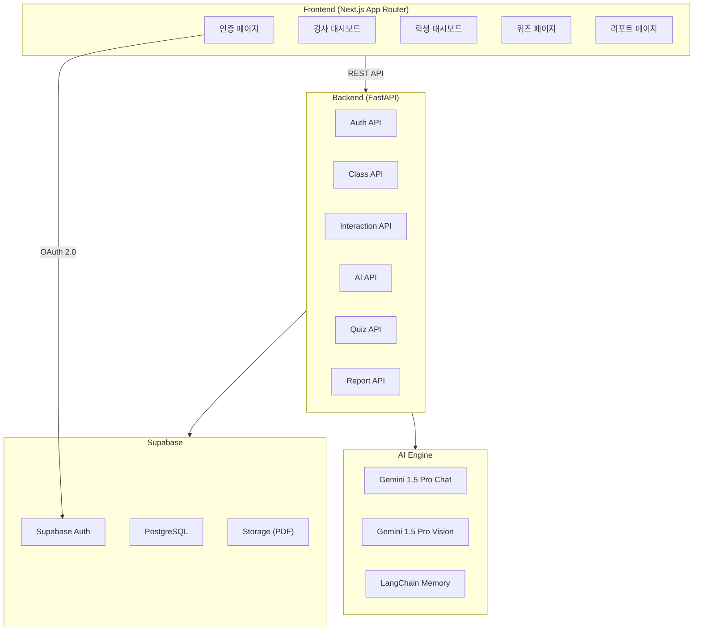
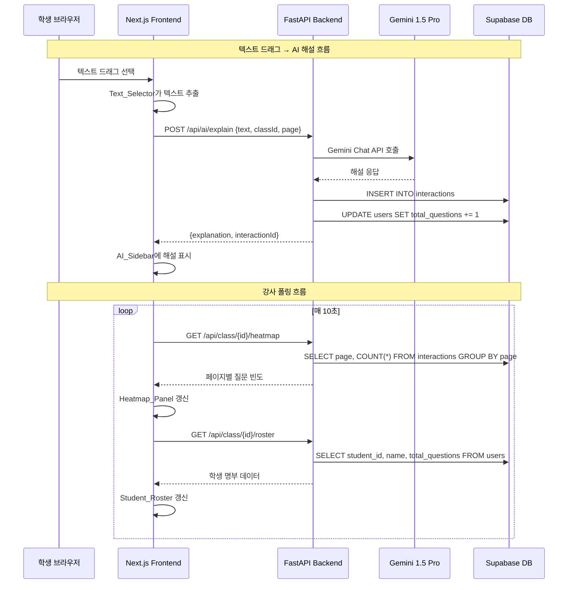
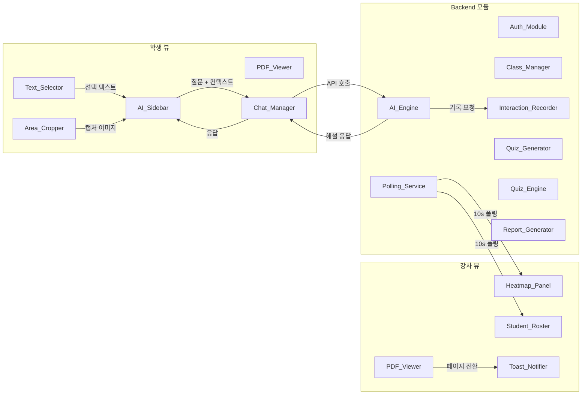
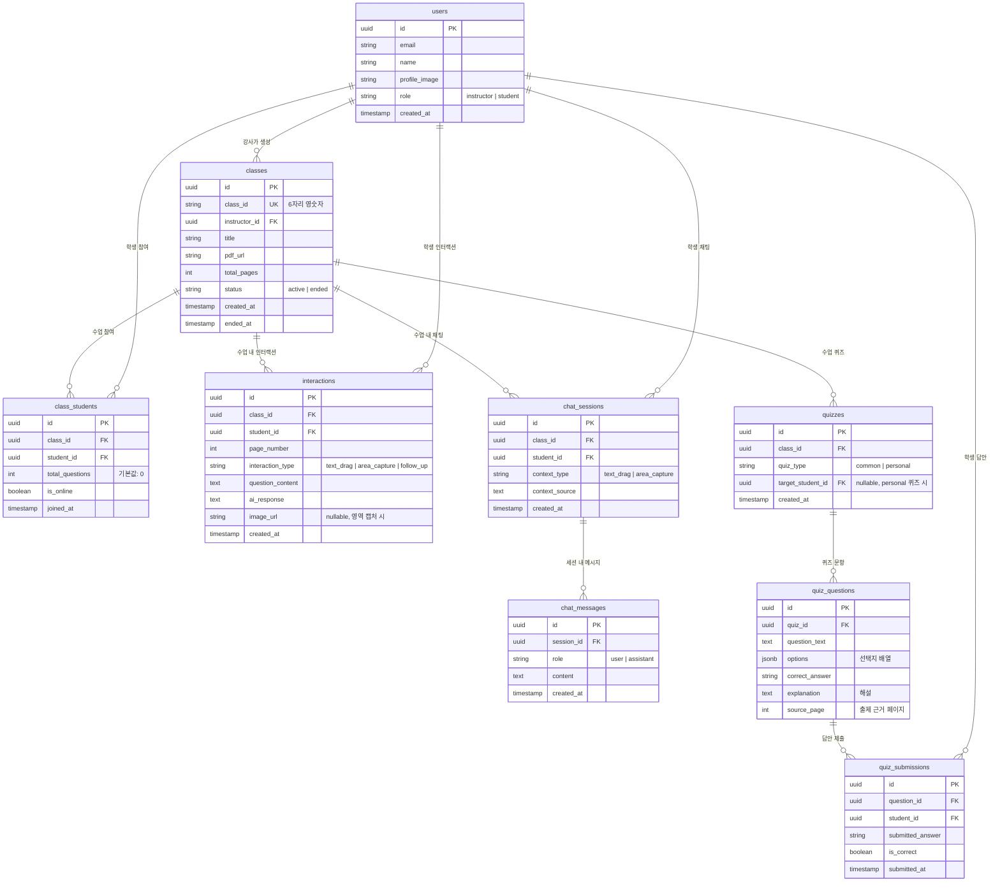

# Edu-Lens AI 플랫폼 기술 설계 문서

## 개요 (Overview)

Edu-Lens AI는 PDF 기반 강의 환경에서 학생과 강사 간의 학습 간극을 해소하는 양방향 AI 튜터링 플랫폼이다. 학생은 PDF 자료를 열람하며 텍스트 드래그 또는 영역 캡처를 통해 AI 해설을 즉시 받을 수 있고, 강사는 실시간 히트맵과 학생 명부를 통해 학습 병목을 파악한다. 수업 종료 시 AI가 자동으로 퀴즈를 생성하고, 최종 학습 리포트를 제공한다.

### 기술 스택

| 계층 | 기술 |
|------|------|
| Frontend | Next.js 14+ (App Router), react-pdf-viewer, react-resizable-panels |
| 상태 관리 | SWR (refetchInterval: 10000ms) |
| Backend | FastAPI (Python 3.11+) |
| AI Engine | Gemini 1.5 Pro (Vision/Chat), LangChain |
| Database | Supabase (PostgreSQL) |
| 인증 | Supabase Auth (Google OAuth 2.0 Provider) |
| 스토리지 | Supabase Storage (PDF 파일) |
| 배포 | Vercel (Frontend), Cloud Run 또는 Railway (Backend) |

### 핵심 설계 원칙

1. **역할 기반 UI 분리**: 강사와 학생의 인터페이스를 완전히 분리하여 각 역할에 최적화된 경험 제공
2. **폴링 기반 동기화**: WebSocket 대신 10초 주기 SWR 폴링으로 구현 복잡도를 낮추면서 준실시간 데이터 갱신 달성
3. **AI 컨텍스트 관리**: LangChain의 ConversationBufferMemory를 활용한 멀티턴 대화 컨텍스트 유지
4. **이벤트 기록 우선**: 모든 학생 인터랙션을 즉시 DB에 기록하여 강사 대시보드와 퀴즈 생성의 데이터 소스로 활용

## 아키텍처 (Architecture)

### High-Level 시스템 아키텍처



### 요청 흐름 (Request Flow)




### Low-Level 모듈 상호작용



## 컴포넌트 및 인터페이스 (Components and Interfaces)

### Frontend 컴포넌트 구조

```
app/
├── (auth)/
│   ├── login/page.tsx          # Google OAuth 로그인
│   └── role-select/page.tsx    # 역할 선택 (강사/학생)
├── (dashboard)/
│   ├── instructor/
│   │   └── [classId]/page.tsx  # 강사 대시보드
│   └── student/
│       └── [classId]/page.tsx  # 학생 대시보드
├── (class)/
│   ├── create/page.tsx         # 수업 생성 (강사)
│   └── join/page.tsx           # 수업 참여 (학생)
├── quiz/[classId]/page.tsx     # 퀴즈 풀이
└── report/[classId]/page.tsx   # 학습 리포트
```

### 주요 Frontend 컴포넌트

#### PDF_Viewer 컴포넌트
```typescript
interface PDFViewerProps {
  pdfUrl: string;
  classId: string;
  role: 'instructor' | 'student';
  onPageChange?: (prevPage: number, currentPage: number) => void;
  onTextSelect?: (text: string, page: number) => void;
}
```

#### AI_Sidebar 컴포넌트
```typescript
interface AISidebarProps {
  classId: string;
  studentId: string;
  currentPage: number;
}

interface ChatMessage {
  id: string;
  role: 'user' | 'assistant';
  content: string;
  contextType: 'text_drag' | 'area_capture' | 'follow_up';
  contextSource?: string;       // 드래그 텍스트 또는 이미지 URL
  timestamp: string;
}

interface ChatSession {
  id: string;
  contextType: 'text_drag' | 'area_capture';
  contextSource: string;
  messages: ChatMessage[];
  createdAt: string;
}
```

#### Heatmap_Panel 컴포넌트
```typescript
interface HeatmapPanelProps {
  classId: string;
  totalPages: number;
  onPageClick: (page: number) => void;
}

interface PageHeatData {
  page: number;
  questionCount: number;
  intensity: number;  // 0.0 ~ 1.0 정규화된 빈도
}
```

#### Student_Roster 컴포넌트
```typescript
interface StudentRosterProps {
  classId: string;
}

interface RosterEntry {
  studentId: string;
  name: string;
  profileImage: string;
  totalQuestions: number;
  isOnline: boolean;
}
```

#### Toast_Notifier 컴포넌트
```typescript
interface ToastNotifierProps {
  message: string;
  duration?: number;  // 기본값: 3000ms
}
```

### Backend API 인터페이스

#### Auth API
```
POST /api/auth/callback     # Google OAuth 콜백 처리
GET  /api/auth/me            # 현재 사용자 정보 조회
PUT  /api/auth/role          # 역할 설정 {role: 'instructor' | 'student'}
```

#### Class API
```
POST   /api/classes                    # 수업 생성 (PDF 업로드 포함)
GET    /api/classes/{class_id}         # 수업 정보 조회
POST   /api/classes/{class_id}/join    # 수업 참여
PUT    /api/classes/{class_id}/end     # 수업 종료
GET    /api/classes/{class_id}/heatmap # 페이지별 질문 빈도
GET    /api/classes/{class_id}/roster  # 학생 명부
```

#### AI API
```
POST /api/ai/explain          # 텍스트 해설 요청
POST /api/ai/explain-image    # 이미지(영역 캡처) 해설 요청
POST /api/ai/chat             # 멀티턴 채팅 (후속 질문)
```

#### Quiz API
```
POST /api/quiz/{class_id}/generate     # 공통 퀴즈 생성 (수업 종료 시)
GET  /api/quiz/{class_id}              # 퀴즈 조회 (공통 + 개인 맞춤)
POST /api/quiz/{class_id}/submit       # 퀴즈 답안 제출
GET  /api/quiz/{class_id}/explanation/{question_id}  # 문항 해설 조회
```

#### Report API
```
GET /api/report/{class_id}/student/{student_id}  # 학생 개인 리포트
GET /api/report/{class_id}/instructor             # 강사 수업 종합 리포트
```

### Backend 모듈 상세 설계

#### Auth_Module (auth_module.py)
```python
class AuthModule:
    async def handle_oauth_callback(self, code: str) -> UserSession:
        """Google OAuth 콜백 처리 → 사용자 프로필 저장 → 세션 생성"""
        ...

    async def get_current_user(self, token: str) -> User:
        """JWT 토큰 검증 → 사용자 정보 반환"""
        ...

    async def set_role(self, user_id: str, role: Role) -> User:
        """사용자 역할 설정 (instructor | student)"""
        ...
```

#### Class_Manager (class_manager.py)
```python
class ClassManager:
    def generate_class_id(self) -> str:
        """고유 6자리 영숫자 Class_ID 생성"""
        ...

    async def create_class(self, instructor_id: str, pdf_file: UploadFile, title: str) -> ClassInfo:
        """수업 생성: Class_ID 발급 + PDF 업로드 + DB 저장"""
        ...

    async def join_class(self, student_id: str, class_id: str) -> ClassInfo:
        """수업 참여: Class_ID 유효성 검증 → 학생 등록"""
        ...

    async def end_class(self, class_id: str, instructor_id: str) -> None:
        """수업 종료: 상태 변경 → 퀴즈 생성 트리거"""
        ...
```

#### AI_Engine (ai_engine.py)
```python
class AIEngine:
    def __init__(self):
        self.chat_model = ChatGoogleGenerativeAI(model="gemini-1.5-pro")
        self.vision_model = ChatGoogleGenerativeAI(model="gemini-1.5-pro")

    async def explain_text(self, text: str, pdf_context: str, page: int) -> str:
        """텍스트 기반 1차 해설 생성"""
        ...

    async def explain_image(self, image_base64: str, pdf_context: str, page: int) -> str:
        """이미지(영역 캡처) 기반 해설 생성 (Vision API)"""
        ...

    async def chat(self, message: str, session_id: str, history: list[ChatMessage]) -> str:
        """멀티턴 대화 — LangChain ConversationBufferMemory 활용"""
        ...

    async def generate_quiz(self, pdf_content: str, hot_pages: list[int]) -> list[QuizQuestion]:
        """질문 빈도 상위 페이지 기반 공통 퀴즈 생성"""
        ...

    async def generate_personal_quiz(self, student_interactions: list[Interaction]) -> list[QuizQuestion]:
        """학생 개인 질문 이력 기반 맞춤 퀴즈 생성"""
        ...
```

#### Interaction_Recorder (interaction_recorder.py)
```python
class InteractionRecorder:
    async def record(self, interaction: InteractionCreate) -> Interaction:
        """인터랙션 기록: interactions 테이블 INSERT + total_questions 카운트 업"""
        ...

    async def get_page_heatmap(self, class_id: str) -> list[PageHeatData]:
        """페이지별 질문 빈도 집계"""
        ...

    async def get_hot_pages(self, class_id: str, top_n: int = 5) -> list[int]:
        """질문 빈도 상위 N개 페이지 반환"""
        ...
```

#### Quiz_Engine (quiz_engine.py)
```python
class QuizEngine:
    async def get_quiz(self, class_id: str, student_id: str) -> HybridQuiz:
        """공통 퀴즈 + 개인 맞춤 퀴즈 통합 조회"""
        ...

    async def submit_answer(self, question_id: str, student_id: str, answer: str) -> QuizResult:
        """답안 제출 → 채점 → 해설 반환"""
        ...
```

#### Report_Generator (report_generator.py)
```python
class ReportGenerator:
    async def generate_student_report(self, class_id: str, student_id: str) -> StudentReport:
        """학생 개인 리포트: 참여도 + 퀴즈 성취도 + 키워드 요약"""
        ...

    async def generate_instructor_report(self, class_id: str) -> InstructorReport:
        """강사 수업 종합 리포트: 전체 통계 + 페이지별 분포 + 평균 성취도"""
        ...
```

## 데이터 모델 (Data Models)

### ER 다이어그램



### 주요 테이블 DDL

```sql
-- 사용자 테이블
CREATE TABLE users (
    id UUID PRIMARY KEY DEFAULT gen_random_uuid(),
    email TEXT UNIQUE NOT NULL,
    name TEXT NOT NULL,
    profile_image TEXT,
    role TEXT CHECK (role IN ('instructor', 'student')),
    created_at TIMESTAMPTZ DEFAULT NOW()
);

-- 수업 테이블
CREATE TABLE classes (
    id UUID PRIMARY KEY DEFAULT gen_random_uuid(),
    class_id VARCHAR(6) UNIQUE NOT NULL,
    instructor_id UUID REFERENCES users(id) NOT NULL,
    title TEXT NOT NULL,
    pdf_url TEXT NOT NULL,
    total_pages INT NOT NULL DEFAULT 0,
    status TEXT CHECK (status IN ('active', 'ended')) DEFAULT 'active',
    created_at TIMESTAMPTZ DEFAULT NOW(),
    ended_at TIMESTAMPTZ
);

-- 수업-학생 매핑 테이블
CREATE TABLE class_students (
    id UUID PRIMARY KEY DEFAULT gen_random_uuid(),
    class_id UUID REFERENCES classes(id) NOT NULL,
    student_id UUID REFERENCES users(id) NOT NULL,
    total_questions INT DEFAULT 0,
    is_online BOOLEAN DEFAULT TRUE,
    joined_at TIMESTAMPTZ DEFAULT NOW(),
    UNIQUE(class_id, student_id)
);

-- 인터랙션 테이블
CREATE TABLE interactions (
    id UUID PRIMARY KEY DEFAULT gen_random_uuid(),
    class_id UUID REFERENCES classes(id) NOT NULL,
    student_id UUID REFERENCES users(id) NOT NULL,
    page_number INT NOT NULL,
    interaction_type TEXT CHECK (interaction_type IN ('text_drag', 'area_capture', 'follow_up')) NOT NULL,
    question_content TEXT NOT NULL,
    ai_response TEXT,
    image_url TEXT,
    created_at TIMESTAMPTZ DEFAULT NOW()
);

-- 인덱스: 히트맵 쿼리 최적화
CREATE INDEX idx_interactions_class_page ON interactions(class_id, page_number);
-- 인덱스: 학생별 인터랙션 조회
CREATE INDEX idx_interactions_student ON interactions(class_id, student_id);

-- 채팅 세션 테이블
CREATE TABLE chat_sessions (
    id UUID PRIMARY KEY DEFAULT gen_random_uuid(),
    class_id UUID REFERENCES classes(id) NOT NULL,
    student_id UUID REFERENCES users(id) NOT NULL,
    context_type TEXT CHECK (context_type IN ('text_drag', 'area_capture')) NOT NULL,
    context_source TEXT NOT NULL,
    created_at TIMESTAMPTZ DEFAULT NOW()
);

-- 채팅 메시지 테이블
CREATE TABLE chat_messages (
    id UUID PRIMARY KEY DEFAULT gen_random_uuid(),
    session_id UUID REFERENCES chat_sessions(id) NOT NULL,
    role TEXT CHECK (role IN ('user', 'assistant')) NOT NULL,
    content TEXT NOT NULL,
    created_at TIMESTAMPTZ DEFAULT NOW()
);

-- 퀴즈 테이블
CREATE TABLE quizzes (
    id UUID PRIMARY KEY DEFAULT gen_random_uuid(),
    class_id UUID REFERENCES classes(id) NOT NULL,
    quiz_type TEXT CHECK (quiz_type IN ('common', 'personal')) NOT NULL,
    target_student_id UUID REFERENCES users(id),
    created_at TIMESTAMPTZ DEFAULT NOW()
);

-- 퀴즈 문항 테이블
CREATE TABLE quiz_questions (
    id UUID PRIMARY KEY DEFAULT gen_random_uuid(),
    quiz_id UUID REFERENCES quizzes(id) NOT NULL,
    question_text TEXT NOT NULL,
    options JSONB NOT NULL,
    correct_answer TEXT NOT NULL,
    explanation TEXT NOT NULL,
    source_page INT NOT NULL
);

-- 퀴즈 답안 제출 테이블
CREATE TABLE quiz_submissions (
    id UUID PRIMARY KEY DEFAULT gen_random_uuid(),
    question_id UUID REFERENCES quiz_questions(id) NOT NULL,
    student_id UUID REFERENCES users(id) NOT NULL,
    submitted_answer TEXT NOT NULL,
    is_correct BOOLEAN NOT NULL,
    submitted_at TIMESTAMPTZ DEFAULT NOW(),
    UNIQUE(question_id, student_id)
);
```

### 핵심 쿼리 패턴

#### 히트맵 데이터 조회 (Polling_Service, 10초 주기)
```sql
SELECT page_number, COUNT(*) as question_count
FROM interactions
WHERE class_id = $1
GROUP BY page_number
ORDER BY page_number;
```

#### 학생 명부 조회 (Polling_Service, 10초 주기)
```sql
SELECT u.id, u.name, u.profile_image, cs.total_questions, cs.is_online
FROM class_students cs
JOIN users u ON cs.student_id = u.id
WHERE cs.class_id = $1
ORDER BY cs.joined_at;
```

#### 인터랙션 기록 + 카운트 업 (트랜잭션)
```sql
BEGIN;
INSERT INTO interactions (class_id, student_id, page_number, interaction_type, question_content, ai_response, image_url)
VALUES ($1, $2, $3, $4, $5, $6, $7);

UPDATE class_students
SET total_questions = total_questions + 1
WHERE class_id = $1 AND student_id = $2;
COMMIT;
```

#### 질문 빈도 상위 페이지 조회 (퀴즈 생성 시)
```sql
SELECT page_number, COUNT(*) as cnt
FROM interactions
WHERE class_id = $1
GROUP BY page_number
ORDER BY cnt DESC
LIMIT $2;
```

## 정확성 속성 (Correctness Properties)

*속성(Property)은 시스템의 모든 유효한 실행에서 참이어야 하는 특성 또는 동작이다. 속성은 사람이 읽을 수 있는 명세와 기계가 검증할 수 있는 정확성 보장 사이의 다리 역할을 한다.*

### Property 1: Class_ID 생성 형식 불변식

*For any* Class_ID 생성 호출에 대해, 반환된 ID는 항상 정확히 6자리이고, 영문자(A-Z, a-z)와 숫자(0-9)로만 구성되어야 한다.

**Validates: Requirements 2.1**

### Property 2: Class_ID 고유성

*For any* N개의 Class_ID 생성 호출에 대해, 생성된 모든 ID는 서로 중복되지 않아야 한다.

**Validates: Requirements 2.1**

### Property 3: 유효한 Class_ID 수업 참여

*For any* 활성 상태의 수업과 해당 수업의 유효한 Class_ID에 대해, 학생이 참여를 요청하면 class_students 테이블에 해당 학생의 레코드가 생성되어야 한다.

**Validates: Requirements 2.3**

### Property 4: 잘못된 Class_ID 에러 처리

*For any* 데이터베이스에 존재하지 않는 문자열에 대해, 수업 참여를 요청하면 항상 에러가 반환되고 class_students 테이블에 어떤 레코드도 생성되지 않아야 한다.

**Validates: Requirements 2.4**

### Property 5: 인터랙션 기록 완전성

*For any* 유효한 인터랙션(text_drag, area_capture, follow_up)에 대해, Interaction_Recorder가 기록을 수행하면 interactions 테이블에 class_id, student_id, page_number, interaction_type, question_content 필드가 모두 포함된 레코드가 생성되어야 한다.

**Validates: Requirements 5.3, 6.3**

### Property 6: 인터랙션 카운트 불변식

*For any* 인터랙션 기록 전후에 대해, 해당 학생의 total_questions 값은 기록 전 값보다 정확히 1 증가해야 한다.

**Validates: Requirements 5.4**

### Property 7: 영역 캡처 유효성

*For any* PDF 페이지 내의 유효한 직사각형 좌표(x, y, width > 0, height > 0)에 대해, Area_Cropper가 캡처를 수행하면 비어있지 않은 이미지 데이터(base64)가 반환되어야 한다.

**Validates: Requirements 6.1**

### Property 8: 대화 컨텍스트 유지

*For any* 채팅 세션과 N개의 메시지 이력에 대해, Chat_Manager가 AI_Engine에 전달하는 컨텍스트는 해당 세션의 모든 이전 메시지를 순서대로 포함해야 한다.

**Validates: Requirements 7.1**

### Property 9: 세션 초기화 및 이력 보존

*For any* 기존 채팅 세션이 있는 상태에서 새로운 컨텍스트(텍스트 드래그 또는 영역 캡처)가 시작되면, 새로운 세션이 생성되고 이전 세션의 모든 메시지는 변경 없이 보존되어야 한다.

**Validates: Requirements 7.3**

### Property 10: 히트맵 빈도 정규화

*For any* 비어있지 않은 페이지별 질문 빈도 배열에 대해, 정규화된 intensity 값은 모두 0.0 이상 1.0 이하이며, 최대 빈도를 가진 페이지의 intensity는 정확히 1.0이어야 한다.

**Validates: Requirements 8.3**

### Property 11: 토스트 메시지 포맷팅

*For any* 양의 정수 N에 대해, 토스트 메시지 생성 함수는 "이전 페이지에서 N명이 질문했습니다" 형식의 문자열을 반환해야 하며, N=0일 때는 "이전 페이지에서 질문이 없었습니다"를 반환해야 한다.

**Validates: Requirements 10.1, 10.2**

### Property 12: 질문 빈도 상위 페이지 정렬

*For any* 인터랙션 데이터 집합과 양의 정수 K에 대해, get_hot_pages 함수가 반환하는 페이지 목록은 최대 K개이며, 질문 빈도 내림차순으로 정렬되어야 한다.

**Validates: Requirements 11.1**

### Property 13: 퀴즈 배포 완전성

*For any* 수업에 등록된 학생 집합에 대해, 공통 퀴즈가 생성되면 모든 등록 학생이 해당 퀴즈를 조회할 수 있어야 한다.

**Validates: Requirements 11.3**

### Property 14: 퀴즈 채점 정확성

*For any* 퀴즈 문항과 제출된 답안에 대해, 답안이 correct_answer와 일치하면 is_correct=true와 핵심 개념 요약이 반환되고, 일치하지 않으면 is_correct=false와 단계별 해설이 반환되어야 한다.

**Validates: Requirements 12.3, 12.4**

### Property 15: 학생 리포트 완전성

*For any* 퀴즈를 완료한 학생에 대해, 생성된 리포트는 수업 참여도(질문 횟수, 활동 시간), 퀴즈 성취도(정답률, 오답 문항), 질문 키워드 요약 필드를 모두 포함해야 한다.

**Validates: Requirements 13.1**

### Property 16: 강사 리포트 통계 정확성

*For any* 수업의 학생 참여 데이터에 대해, 강사 리포트의 퀴즈 평균 성취도는 개별 학생 성취도의 산술 평균과 일치해야 하며, 페이지별 질문 분포의 합은 전체 질문 수와 일치해야 한다.

**Validates: Requirements 13.3**

## 에러 처리 (Error Handling)

### Frontend 에러 처리

| 에러 유형 | 처리 방식 | 사용자 피드백 |
|-----------|-----------|---------------|
| OAuth 인증 실패 | catch → 로그인 페이지 유지 | "인증에 실패했습니다. 다시 시도해주세요." 토스트 |
| 잘못된 Class_ID | 400 응답 처리 | "유효하지 않은 수업 코드입니다." 인라인 에러 |
| 종료된 수업 참여 | 410 응답 처리 | "이미 종료된 수업입니다." 인라인 에러 |
| AI 해설 타임아웃 | 10초 타임아웃 → 재시도 | "AI 응답이 지연되고 있습니다. 다시 시도해주세요." |
| PDF 로드 실패 | react-pdf-viewer 에러 콜백 | "PDF를 불러올 수 없습니다." 에러 화면 |
| 네트워크 에러 | SWR onError 핸들러 | 토스트 알림 + 자동 재시도 |
| 미인증 접근 | 401 응답 → 리다이렉트 | 로그인 페이지로 자동 이동 |

### Backend 에러 처리

```python
# 공통 에러 응답 형식
class ErrorResponse(BaseModel):
    error: str
    message: str
    detail: str | None = None

# HTTP 예외 매핑
ERROR_MAP = {
    "INVALID_CLASS_ID": (400, "유효하지 않은 수업 코드입니다."),
    "CLASS_ENDED": (410, "이미 종료된 수업입니다."),
    "UNAUTHORIZED": (401, "인증이 필요합니다."),
    "FORBIDDEN": (403, "권한이 없습니다."),
    "AI_TIMEOUT": (504, "AI 서비스 응답 시간이 초과되었습니다."),
    "PDF_UPLOAD_FAILED": (500, "PDF 업로드에 실패했습니다."),
    "QUIZ_NOT_READY": (404, "퀴즈가 아직 생성되지 않았습니다."),
}
```

### AI Engine 에러 처리

| 에러 유형 | 처리 방식 |
|-----------|-----------|
| Gemini API 호출 실패 | 최대 3회 재시도 (exponential backoff) |
| Rate Limit 초과 | 429 응답 시 대기 후 재시도 |
| 응답 파싱 실패 | 기본 응답 반환 + 로그 기록 |
| Vision API 이미지 처리 실패 | "이미지를 분석할 수 없습니다" 응답 반환 |
| 컨텍스트 길이 초과 | 오래된 메시지부터 제거하여 컨텍스트 축소 |

### 데이터베이스 에러 처리

- **트랜잭션 실패**: 인터랙션 기록 + 카운트 업은 단일 트랜잭션으로 처리. 실패 시 전체 롤백
- **중복 키 충돌**: Class_ID 생성 시 중복 발생하면 재생성 (최대 5회)
- **연결 풀 고갈**: Supabase 연결 풀 설정 (max_connections: 20) + 타임아웃 처리

## 테스트 전략 (Testing Strategy)

### 테스트 계층

```
┌─────────────────────────────────────┐
│         E2E Tests (Playwright)       │  수업 생성 → 참여 → 질문 → 퀴즈 전체 흐름
├─────────────────────────────────────┤
│      Integration Tests (pytest)      │  API 엔드포인트 + DB 연동
├─────────────────────────────────────┤
│    Property Tests (Hypothesis)       │  정확성 속성 검증 (100+ iterations)
├─────────────────────────────────────┤
│   Unit Tests (pytest + vitest)       │  개별 함수/컴포넌트 검증
└─────────────────────────────────────┘
```

### Property-Based Testing (Hypothesis)

이 프로젝트는 순수 함수 로직(Class_ID 생성, 히트맵 정규화, 채점, 리포트 통계 등)이 다수 존재하므로 PBT가 적합하다.

- **라이브러리**: Python — [Hypothesis](https://hypothesis.readthedocs.io/), TypeScript — [fast-check](https://fast-check.dev/)
- **최소 반복 횟수**: 각 속성 테스트당 100회 이상
- **태그 형식**: `Feature: edu-lens-ai-platform, Property {N}: {property_text}`

#### Backend Property Tests (Hypothesis)

| Property | 테스트 대상 | 생성기 |
|----------|------------|--------|
| 1, 2 | `ClassManager.generate_class_id()` | 반복 호출 |
| 3, 4 | `ClassManager.join_class()` | `st.text(alphabet=string.ascii_letters+string.digits, min_size=6, max_size=6)` |
| 5, 6 | `InteractionRecorder.record()` | `st.builds(InteractionCreate, ...)` |
| 8, 9 | `ChatManager` 컨텍스트 관리 | `st.lists(st.builds(ChatMessage, ...))` |
| 10 | `normalize_heatmap()` | `st.lists(st.integers(min_value=0), min_size=1)` |
| 12 | `get_hot_pages()` | `st.dictionaries(st.integers(min_value=1), st.integers(min_value=0))` |
| 14 | `QuizEngine.submit_answer()` | `st.builds(QuizQuestion, ...) + st.text()` |
| 15, 16 | `ReportGenerator` | `st.lists(st.builds(StudentData, ...))` |

#### Frontend Property Tests (fast-check)

| Property | 테스트 대상 | 생성기 |
|----------|------------|--------|
| 7 | `Area_Cropper` 캡처 로직 | `fc.record({x: fc.nat(), y: fc.nat(), w: fc.nat({min:1}), h: fc.nat({min:1})})` |
| 11 | `formatToastMessage()` | `fc.nat()` |

### Unit Tests

#### Backend (pytest)
- Auth_Module: OAuth 콜백 처리, 역할 설정
- Class_Manager: 수업 생성, 참여, 종료
- AI_Engine: Mock Gemini API로 해설/퀴즈 생성 흐름
- Quiz_Engine: 퀴즈 조회, 답안 제출

#### Frontend (vitest + React Testing Library)
- 컴포넌트 렌더링: PDF_Viewer, AI_Sidebar, Heatmap_Panel, Student_Roster
- 역할 기반 라우팅: Dashboard_Router
- 인증 가드: 미인증 시 리다이렉트
- 토스트 알림: Toast_Notifier 표시/숨김

### Integration Tests (pytest)
- API 엔드포인트 전체 흐름 (수업 생성 → 참여 → 인터랙션 기록 → 히트맵 조회)
- Supabase DB 연동 (CRUD 검증)
- SWR 폴링 데이터 갱신 (10초 주기)
- 퀴즈 생성 → 배포 → 풀이 → 리포트 흐름

### E2E Tests (Playwright)
- 강사 시나리오: 로그인 → 수업 생성 → PDF 업로드 → 히트맵 확인 → 수업 종료
- 학생 시나리오: 로그인 → 수업 참여 → 텍스트 드래그 → AI 해설 → 퀴즈 풀이 → 리포트 확인
