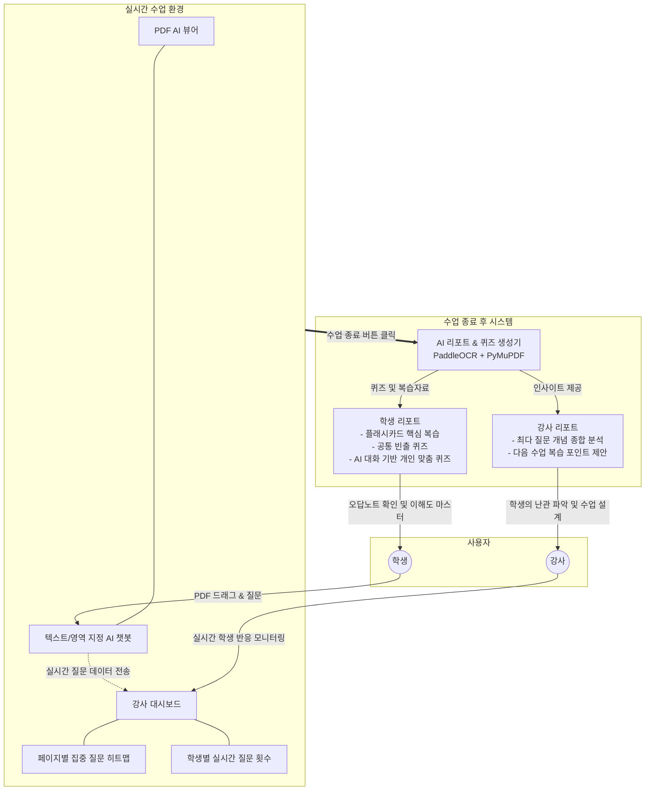

# Edu-Lens

> **"강사와 학생의 실시간 이해도 격차를 줄이는 AI 기반 인터랙티브 학습 플랫폼"**

## 기획 배경 및 목적

대학 강의 등 다대일 교육 환경에서 교수는 **"학생들이 현재 수업을 잘 따라오고 있는지"** 실시간으로 파악하기 어렵고, 반대로 학생들은 수업 속도를 따라가지 못해 질문 타이밍을 놓치거나 이해도를 잃어버리는 문제가 빈번하게 발생합니다.

Edu-Lens는 이러한 구조적 문제를 해결하기 위해 기획되었습니다. 수업 중 학생의 이해 속도를 높여주고, 발생한 질문 데이터를 실시간으로 수집하여 강사에게 시각화해 줌으로써 **학생의 학습 능률과 강사의 수업 준비 능률을 동시에 극대화**하는 것을 목표로 합니다.

---

## 핵심 기능 (Features)

### 학생 (Student)
- **초고속 AI 질의응답 (PDF 뷰어 연동)**
  - 수업 자료(PDF)를 띄워놓고 보던 중 모르는 부분이 생기면, **텍스트를 드래그하거나 영역을 지정**하는 것만으로 우측 사이드바의 AI에게 즉시 질문할 수 있습니다.
  - 긴 질문을 치는 시간을 날려버리고, 수업 흐름에 방해받지 않으면서 AI의 명쾌한 답변을 얻을 수 있습니다.
- **플래시카드 기반 맞춤형 복습**
  - 수업이 종료되면, 당일 수업의 중요 내용을 플래시카드 형태로 제공받아 직관적이고 빠르게 복습할 수 있습니다.
- **2-Track 퀴즈 시스템 (공통 & 맞춤)**
  - **공통 퀴즈**: 전체 수강생들이 가장 많이 헷갈려 했던(=질문이 집중됐던) 페이지의 실제 내용을 바탕으로 문제를 생성하여 제공합니다.
  - **개인 맞춤 퀴즈**: 학생 본인이 AI와 나누었던 대화 기록과 질문 내역을 정밀 반영하여, 철저하게 '나의 취약점'을 점검할 수 있는 개인화 문제를 제공합니다.
- **오답노트 및 해설 리포트**
  - 생성된 퀴즈를 직접 풀어보고, 오답과 상세한 해설을 담은 학습 리포트를 통해 최종 점검을 완벽하게 끝낼 수 있습니다.

### 강사 (Instructor)
- **실시간 페이지 히트맵 (Real-time Heatmap)**
  - 강사 대시보드 화면 좌측에서, 현재 학생들이 어떤 페이지에서 가장 많이 헤매고 질문을 던지는지 열화상(히트맵) 형태로 직관적인 확인이 가능합니다.
- **학생별 참여도 실시간 모니터링**
  - 우측 패널을 통해 어떤 학생이, 얼만큼의 질문을 던지고 상호작용하고 있는지 실시간으로 데이터가 업데이트됩니다. 이를 통해 강사는 수업 중 즉각적인 페이스 조절이 가능합니다.
- **통합 인사이트 리포트 (다음 수업 준비)**
  - 수업 종료 시, "오늘 학생들이 집중적으로 어려워한 개념"이 무엇인지 상세한 분석 결과를 리포트로 받게 됩니다.
  - 이를 통해 **다음 시간 복습 포인트**나 핵심 위주로 짚어주어야 할 점 등을 제안받아, 압도적으로 편리하게 다음 수업을 설계할 수 있습니다.

---

## 시스템 아키텍처 및 플로우 (Structure)

---

## 기대 효과 (Win-Win)
지금까지의 일방향적 교육 한계를 탈피하여 강사와 학생 모두에게 비약적인 능률 상승을 선물합니다.

1. **강사 (Instructor)**: 강의 중 파악이 불가했던 학생들의 진짜 속마음(이해도)을 투명한 데이터로 들여다보고, 인사이트 리포트를 통해 완벽에 가까운 맞춤형 다음 수업 스크립트를 준비할 수 있습니다.
2. **학생 (Student)**: 질문하기 부끄럽거나 타이밍을 놓쳤던 과거와 달리 즉각적으로 AI에게 힌트를 얻고, 방과 후에는 날카롭게 분석된 맞춤형 퀴즈로 학습 공백을 100% 매울 수 있습니다.
