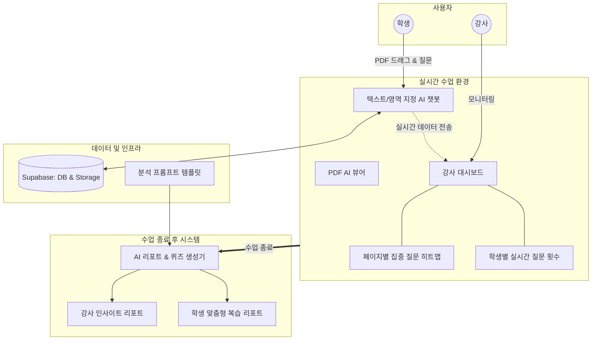

# Edu-Lens
> **"강사와 학생의 실시간 이해도 격차를 줄이는 AI 기반 인터랙티브 학습 플랫폼"**

Edu-Lens는 대학 강의 및 전문 교육 현장과 같은 다대일(1:N) 환경에서 발생하는 소통의 불균형을 해결하기 위해 기획되었습니다. 실시간 학습 데이터를 시각화하여 강사에게는 **수업 운영의 나침반**을, 학생에게는 **개인 맞춤형 학습 비서**를 제공하여 교육의 질을 상향 평준화합니다.

---

## 기획 배경 및 목적

*   **강사 측면**: 다수의 학생을 대상으로 하는 강의에서 개별 학생의 이해도를 실시간으로 파악하기 어려우며, 학생들의 침묵은 수업 속도 조절 및 취약 부분 보강의 걸림돌이 됩니다.
*   **학생 측면**: 수업 흐름을 끊을까 봐 질문을 주저하거나, 방대한 자료 중 어느 부분을 모르는지 몰라 복습에 과도한 시간을 소요하는 '질문의 병목 현상'이 발생합니다.

---

## 핵심 기능 (Features)

### 강사 (Instructor)
*   **실시간 페이지 히트맵 및 모니터링**: 학생들이 PDF 교재의 어느 페이지에 머무는지, AI 질문이 어디서 집중되는지 실시간 히트맵으로 시각화하여 즉각적인 강의 페이스 조절을 돕습니다.
*   **질문 카운트 기반 학생명부**: 실시간으로 집계되는 질문 횟수를 통해 개별 학생의 참여도와 이해도를 정량적으로 확인합니다.
*   **통합 인사이트 리포트**: 수업 종료 후 학생들이 가장 어려워했던 개념을 분석하여 제공함으로써 다음 수업 설계의 효율성을 극대화합니다.

### 학생 (Student)
*   **PDF 연동형 초고속 AI 질의응답**: 별도의 탭을 열 필요 없이 PDF 내 모르는 영역을 드래그하거나 캡처하는 것만으로 AI가 즉시 맥락을 파악해 답변을 제공합니다.
*   **플래시카드 기반 맞춤형 복습**: 당일 수업의 핵심 내용을 요약한 플래시카드를 통해 직관적인 복습이 가능합니다.
*   **2-Track 퀴즈 시스템**: 전체 수강생 빈출 질문 기반의 **공통 퀴즈**와 본인의 질문 내역을 반영한 **개인 맞춤 퀴즈**를 제공합니다.
*   **오답노트 및 학습 리포트**: 퀴즈 풀이 결과와 상세 해설을 포함한 리포트를 통해 완벽한 최종 점검을 지원합니다.

---

## AI 빌딩 전략 및 워크플로우

본 프로젝트는 모델별 강점에 따라 작업을 분배하여 리소스 최적화와 개발 정밀도를 동시에 확보했습니다.

### 1. 활용 도구 및 모델 전략
*   **AWS KIRO (Steering 기능)**: Requirements, Design, Tasks 파일을 세부적으로 구축하여 용어 선정 및 시스템 아키텍처의 일관성 확보.
*   **Google Antigravity (Main IDE)**: 여러 모델을 유연하게 교체하며 GCP 크레딧을 활용해 비용 효율적인 개발 진행.
*   **Hybrid Model 구성**:
    *   **Claude 3.5 Sonnet / Opus**: 탁월한 추론 능력을 바탕으로 프로젝트 플랜 수립 및 복잡한 버그 수정 전담.
    *   **Gemini 1.5 Pro**: 최상위 코딩 능력을 활용한 메인 비즈니스 로직 및 기능 구현 담당.
    *   **Gemini 1.5 Flash**: 넉넉한 토큰량을 바탕으로 실제 코드 수정 및 반복적인 디버깅 수행.

### 2. 에이전트 협업 시스템 (Multi-Agent)
Gemini CLI에서 세 가지 에이전트를 동시 운용하여 개발 신뢰도를 높였습니다.
1.  **Planner**: 설계 문서에 따라 에이전트들이 수행해야 할 단계별 실행 계획 수립.
2.  **Builder**: 실제 기능 코드 작성 및 구현.
3.  **Reviewer**: 작성된 코드의 버그 유무 검토 및 테스트 수행.

---

## 시스템 아키텍처 (Structure)

---

## 사용자 흐름 및 스크린샷 (User Flow & Screenshots)

### 1. 공통 (역할 선택)
서비스 접속 시 사용자의 역할(강사 또는 학생)을 선택하여 맞춤형 인터페이스로 진입합니다.

| 서비스 진입 및 역할 선택 |
| :---: |
|  |

---

### 2. 강사 흐름 (Instructor Flow)
강사는 실시간으로 학생들의 학습 상태를 모니터링하고, 수업 종료 후 체계적인 분석 리포트를 확인합니다.

| 1. 강사 정보 입력 | 2. 수업 및 학습 자료 설정 |
| :---: | :---: |
|  |  |

| 3. 실시간 모니터링 (히트맵/활동) | 4. AI 상호작용 분석 |
| :---: | :---: |
|  |  |

| 5. 수업 종료 및 리포트 생성 | 6. 강사 전용 인사이트 리포트 |
| :---: | :---: |
|  |  |

---

### 3. 학생 흐름 (Student Flow)
학생은 PDF 자료와 연동된 AI 도우미를 통해 실시간으로 궁금증을 해결하고, 맞춤형 퀴즈와 리포트로 학습을 완성합니다.

| 1. 학생 정보 입력 및 입장 | 2. PDF 연동 AI 학습 도메인 |
| :---: | :---: |
|  |  |

| 3. 영역 캡처 기반 AI 질의응답 | 4. 실시간 이해도 점검 퀴즈 |
| :---: | :---: |
|  |  |

| 5. 핵심 개념 플래시카드 복습 | 6. 오답 노트 및 해설 |
| :---: | :---: |
|  |  |

| 7. 학생 맞춤형 학습 성과 리포트 |
| :---: |
|  |

---

## 유지보수성 및 재현성 전략

*   **중앙 집중형 데이터 관리**: Supabase를 활용하여 실시간 DB 연동과 PDF 저장소 기능을 일원화했습니다. 로컬 DB 구축 없이도 모든 개발자가 동일한 데이터 소스를 참조하여 데이터 정합성을 보장합니다.
*   **코드 일관성**: KIRO의 steering 파일로 전역 규칙을 정의하고, 공통 모듈(Supabase 클라이언트, 에러 매핑 등)을 단일 파일에서 관리하여 유지보수성을 높였습니다.
*   **환경 재현성**: `requirements.txt`(Backend)와 `package.json`(Frontend)에 모든 패키지 버전을 명시하여 즉각적인 환경 구축이 가능합니다.
*   **품질 보장**: 분석 프롬프트를 템플릿화하여 AI 응답 품질의 일관성을 유지하고 성능 저하를 방지했습니다.

---

## 기대 효과

1.  **강의 질적 상향 평준화**: 데이터 기반의 강의 속도 조절과 취약 부분 집중 공략이 가능해집니다.
2.  **학습 이탈 방지 및 몰입도 향상**: 질문의 문턱을 낮추고 즉각적인 피드백을 제공하여 교육 현장의 낙오자 발생을 최소화합니다.
3.  **개인화 교육(Adaptive Learning)의 실현**: 공통 강의 환경에서도 1:1 과외에 가까운 개인별 맞춤형 복습 경험을 제공합니다.

---
주원 (juwon1217) | [GitHub](https://github.com/juwon1217)
